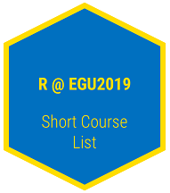

# R at EGU2019  

*This repository serves as a quick reference to all short courses related to or aimed at teaching R.*

## Courses

### Using R in Hydrology (SC1.44/HS12.5)
Conveners: Alexander Hurley, Lucy Barker, Louise Slater, Guillaume Thirel, Claudia Vitolo

Course description: [Click here](updated asap)

### 
